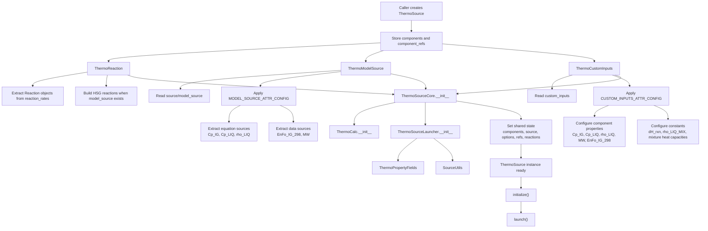
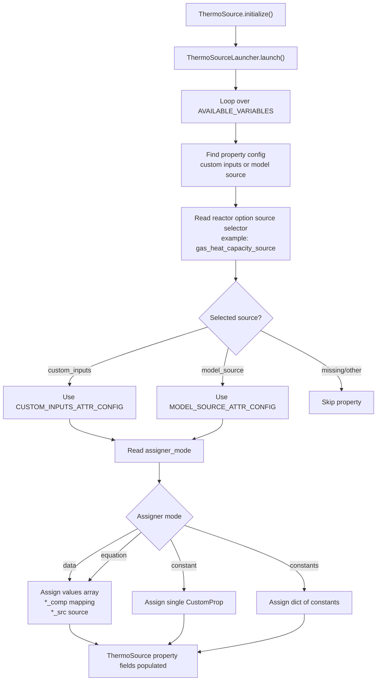
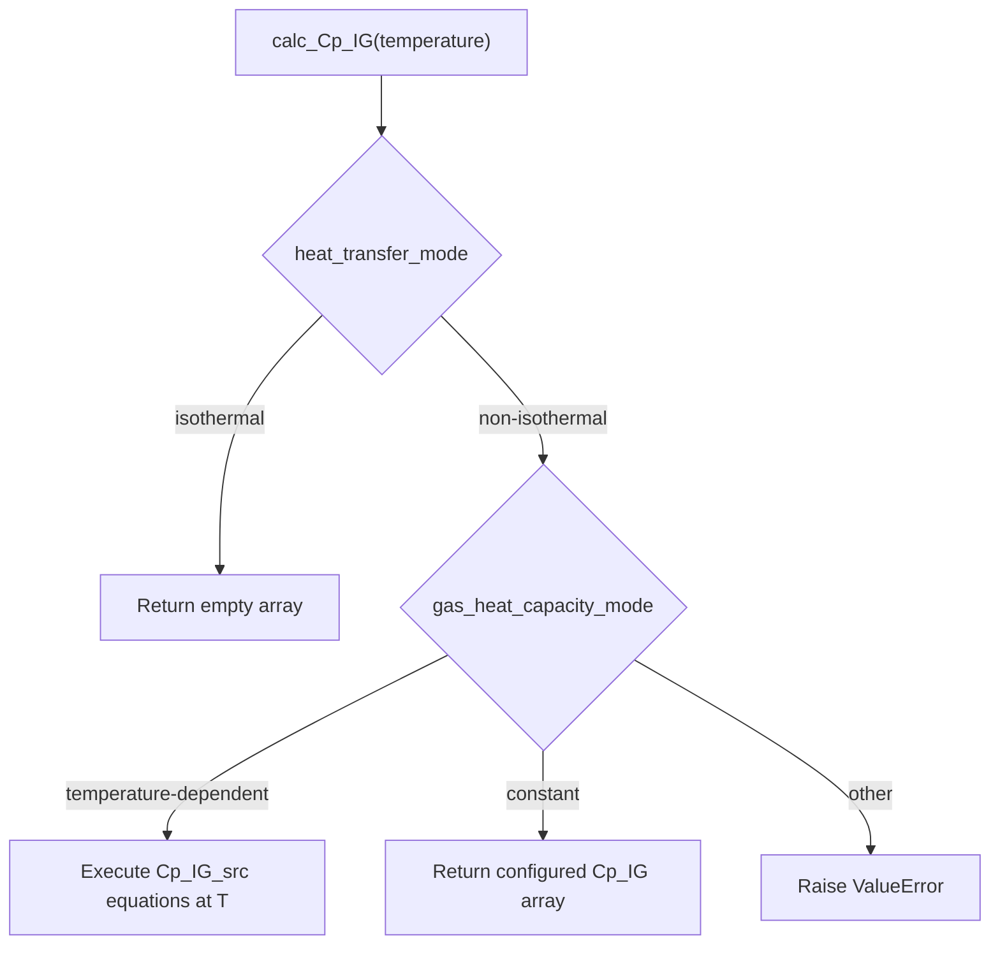
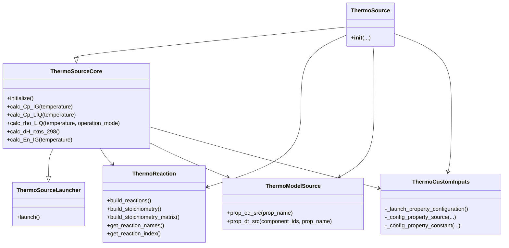

# ThermoSource

`ThermoSource` is the public orchestration class for thermodynamic source setup.
It does not directly extract every property itself. Instead, it builds three
specialized helper objects and passes them into `ThermoSourceCore`, which exposes
the calculation API used by reactor simulations.

## Construction Diagram

## Initialization / Property Assignment Flow

After construction, call `initialize()` to run the source assignment step.

## How `ThermoSource` Works

`ThermoSource` receives:

- `components`: component definitions used throughout the thermodynamic model.
- `source`: the `pyThermoLinkDB` source object used to retrieve equation/data sources.
- `model_source`: optional source model used for HSG and enthalpy calculations.
- `custom_inputs`: optional user-provided constants or component-wise properties.
- `reactor_options`: controls phase, property modes, and where each property should come from.
- `heat_transfer_options`: controls whether heat-capacity and enthalpy calculations are needed.
- `reaction_rates`: kinetic expressions that contain the underlying reactions.
- `component_refs`: normalized component ids, formula/state ids, mapper, and index map.
- `component_key`: the key convention used to match components and property data.

The constructor performs these steps:

1. It stores `components` and `component_refs` on the instance.
2. It creates `ThermoReaction`, which extracts `Reaction` objects from
   `reaction_rates` and builds HSG reactions when `model_source` is available.
3. It creates `ThermoModelSource`, which extracts property equation/data sources
   from the external `source` according to `MODEL_SOURCE_ATTR_CONFIG` and
   `MODEL_SOURCE_CRITERIA`.
4. It creates `ThermoCustomInputs`, which validates and converts properties from
   `custom_inputs` according to `CUSTOM_INPUTS_ATTR_CONFIG` and
   `CUSTOM_INPUTS_CRITERIA`.
5. It initializes `ThermoSourceCore` with the three helper objects.

`ThermoSourceCore` is where the final runtime object is assembled. It:

- initializes `ThermoCalc`;
- initializes `ThermoSourceLauncher`;
- stores reactor, heat-transfer, source, reaction, and component-reference state;
- exposes reaction lists through `self.reactions` and `self.hsg_reactions`;
- copies important reactor settings such as phase, density mode, heat-capacity
  mode, formation-enthalpy source, and reaction-enthalpy mode.

## Source Selection Logic

The property source is not hard-coded in `ThermoSource`. It is selected from
`reactor_options`.

For example:

- `gas_heat_capacity_source == "model_source"` uses model-source configuration
  and usually stores an equation source in `Cp_IG_src`.
- `gas_heat_capacity_source == "custom_inputs"` uses custom inputs and stores
  numeric values in `Cp_IG`, `Cp_IG_comp`, and `Cp_IG_src`.
- `liquid_density_source`, `molecular_weight_source`,
  `ideal_gas_formation_enthalpy_source`, and other source selector fields work
  the same way.

The criteria blocks decide whether a property is configured. Typical checks are:

- phase must match, such as `gas` or `liquid`;
- heat transfer mode must match, such as `non-isothermal`;
- property mode must match, such as `constant` or `temperature-dependent`;
- selected source must match, such as `custom_inputs` or `model_source`.

## Runtime Calculations

Once initialized, the object can calculate or return thermodynamic properties.
Important methods live in `ThermoSourceCore`, including:

- `calc_Cp_IG(temperature)`: ideal-gas heat capacity.
- `calc_Cp_LIQ(temperature)`: liquid heat capacity.
- `calc_rho_LIQ(temperature, operation_mode=None)`: liquid density.
- `calc_dCp_IG()`: reaction heat-capacity changes from stoichiometry.
- `calc_dH_rxns_298()`: reaction enthalpies at 298 K from formation enthalpies.
- `calc_dH_rxns_IG(temperature)`: ideal-gas reaction enthalpies at temperature.
- `calc_dH_rxns_LIQ(temperature)`: liquid-phase reaction enthalpy path.
- `calc_En_IG(temperature)`: component ideal-gas enthalpies.

The calculation methods choose between configured constants and executable
equation sources. For example, `calc_Cp_IG()`:

## Main Responsibility Split

